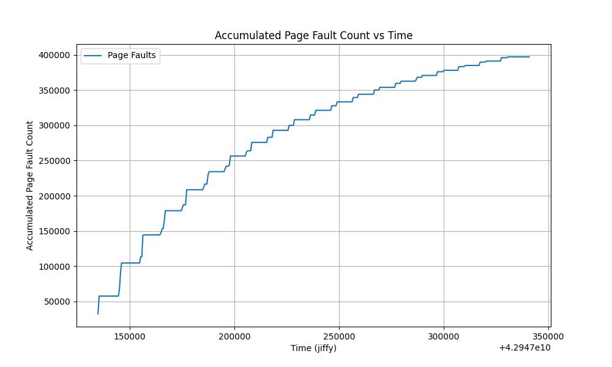
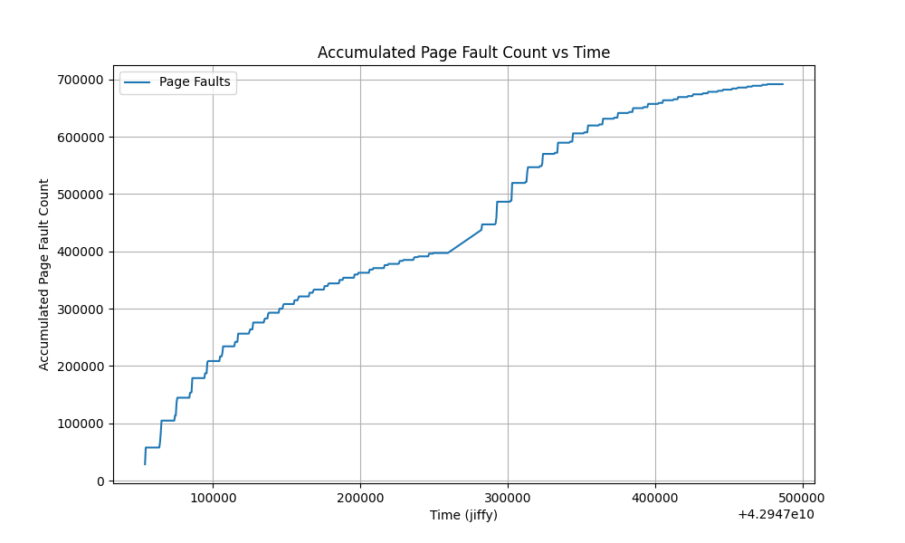
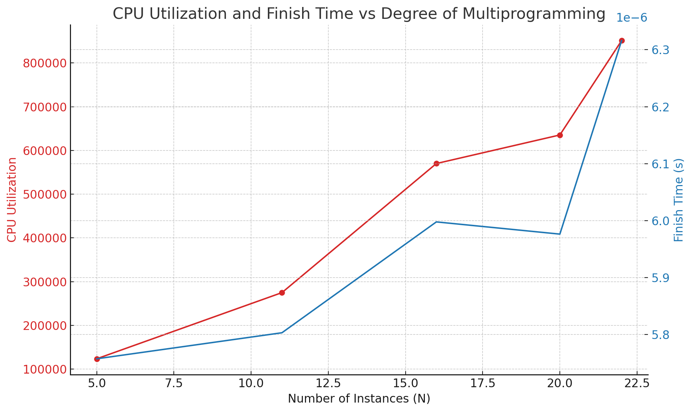

# PageFaultProfiler
The module's primary purpose is to profile and monitor specific processes, tracking their minor/major page faults and CPU utilization.

**Process Registration/Unregistration (`reg_pid`, `unreg_pid`):**
   - Processes are registered/unregistered for monitoring via the `/proc` file system interface.
   - Upon registration, a `work_block` is allocated and added to `work_list`.
   - Unregistration removes the `work_block` from the list and frees memory.

2. **Profiling (`profiler_work_handler`):**
   - Periodically executed to collect data for each registered process.
   - Accumulates minor/major faults and CPU usage.
   - Data is stored in `buffer`.

3. **Memory Mapping (`device_mmap`):**
   - Allows user-space applications to map the profiling buffer into their address space for direct access.

4. **Cleanup (`mp3_exit`):**
   - Ensures proper resource deallocation and cleanup when the module is unloaded.

## Case Study Analysis
The ploting implemented in [drawing.py](drawing.py), testing script in [test.sh](test.sh)

### Case Study 1: Profiling Page Faults and CPU Utilization

- Data is collected on minor+major faults and CPU utilization.
- The major page fault count was relatively small and challenging to demonstrate visually, so it has been excluded from the plot for clarity. Detailed data, including major page fault counts, can be found in the files [profile1.data](profile1.data) and [profile2.data](profile2.data).
- The graphs plotted below demonstrate the trends in these metrics over time, providing insights into the system's behavior under various workloads. **Observably, when the memory size and access method remain constant, an increase in the number of accesses per iteration results in a longer time to complete the work and a higher incidence of page faults. This trend underscores the impact of memory access patterns on system performance and resource utilization.**

### Case Study 2: CPU Utilization vs. Degree of Multiprogramming

- Multiple instances of a memory-intensive process are run, and CPU utilization ($\text{CPUTime /   WallTime}$) is monitored.
- A more detailed data can be find in [profile3.data](profile3.data)
- The analysis reveals how CPU utilization scales with increased multiprogramming and highlights system bottlenecks.
- **We conclude that when the $N$ increased, the CPU ultilization increased as well.**

